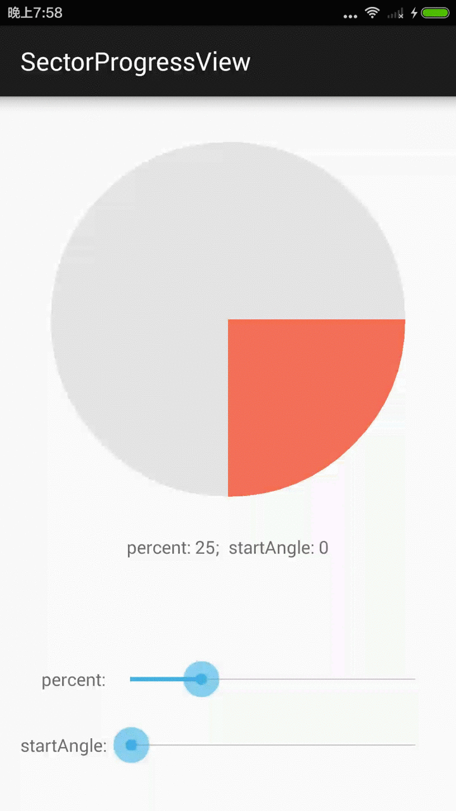

SectorProgressView
==================

This is a simple progress prompt or chart widget using circle and a sector.

Demo
=====



[.APK Download](https://github.com/timqi/SectorProgressView/raw/master/art/SectorProgressView-V1.0-Example.apk)

How to use
===========

- Define views in xml

```xml
<com.timqi.sectorprogressview.SectorProgressView
        xmlns:app="http://schemas.android.com/apk/res-auto"
        android:id="@+id/spv"
        app:bgColor="#e5e5e5"   // The Backgroud Color of Circle.
        app:fgColor="#ff765c"   // The Foregroud Color of Circle
        app:percent="25"        // Current percent. "100" is full
        app:startAngle="0"      // Start Angle of the foreground sector
        />
```

- You can custom view using java code

```java
spv = (SectorProgressView) findViewById(R.id.spv);
spv.setPercent(25);
spv.setStartAngle(0);
spv.setBgColor(0xffe5e5e5);
spv.setFgColor(0xffff765c);
```

Integration
============

- Clone the repo from github. If you are using Android Studio. Select `File -> New -> Import Module` and navigate the source directory to the `library` folder is OK!

License
=======

    Copyright 2015 Tim Qi

    Licensed under the Apache License, Version 2.0 (the "License");
    you may not use this file except in compliance with the License.
    You may obtain a copy of the License at

       http://www.apache.org/licenses/LICENSE-2.0

    Unless required by applicable law or agreed to in writing, software
    distributed under the License is distributed on an "AS IS" BASIS,
    WITHOUT WARRANTIES OR CONDITIONS OF ANY KIND, either express or implied.
    See the License for the specific language governing permissions and
    limitations under the License.
